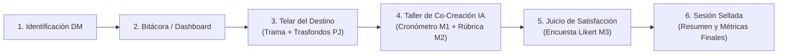

# ⚔️ DungIAn — Asistente de Preparación para Dungeon Masters

> **Proyecto de Tesis / Gestión de Proyectos — Universidad Privada Antenor Orrego (UPAO 2026)**  
> **Línea de investigación:** Robótica, automatización avanzada y sistemas inteligentes  
> **Sublínea:** Inteligencia artificial  
> **Título de Tesis:** *“Sistema web con IA generativa para mejorar la preparación de sesiones de rol en una comunidad digital 2026”*

[](https://dnd.wizards.com/)
[](LICENSE)
[](index.html)

---

## 📖 Descripción del Proyecto

**DungIAn** es una plataforma web fundamentada en el paradigma de **Co-creación Humano-IA (*Human-in-the-Loop*)**, diseñada específicamente para asistir a los **Dungeon Masters (DMs)** en la fase previa de preparación de sesiones de rol para *Dungeons & Dragons (5ª Edición)*.

El sistema **no sustituye la labor ni el criterio del Dungeon Master**, sino que actúa como un copiloto creativo:
1. **Ingesta de Contexto:** El DM introduce la premisa de la trama y las fichas/trasfondos de los personajes de sus jugadores.
2. **Generación Asistida:** La IA teje conexiones narrativas con ramificaciones no lineales, genera fichas estructuradas de NPCs (*Stat Blocks* oficiales de D&D 5e) y diseña la distribución táctica del mapa en cuadrícula de 5 pies.
3. **Control Creativo Humano:** El DM edita, ajusta, aprueba o descarta cada propuesta antes de incorporarla al resumen final de la sesión.

---

## 🎯 Indicadores Experimentales de la Investigación

El impacto del sistema se evalúa mediante un diseño experimental contrastando el método convencional frente al uso de **DungIAn**:

| Código | Indicador | Dimensión | Unidad de Medida | Instrumento |
| :---: | :--- | :--- | :--- | :--- |
| **M1** | **Tiempo promedio de preparación** | Eficiencia | Minutos cronometrados | Cronómetro integrado en plataforma |
| **M2** | **Cantidad de elementos válidos preparados** | Productividad | Número de elementos | Rúbrica estructurada de validez de rol |
| **M3** | **Nivel de satisfacción del Dungeon Master** | Percepción | Escala Likert (1 a 5) | Cuestionario post-preparación validado |

---

## 🚀 Flujo de Usuario y Pantallas del Prototipo



1. **Identificación del Dungeon Master:** Registro de alias y años de experiencia para control de variables intervinientes.
2. **Bitácora de Campañas:** Historial de aventuras preparadas y promedios históricos de tiempo y productividad.
3. **El Telar del Destino (Contexto):** Formulario para registrar la trama central y las hojas/trasfondos de los aventureros de la mesa.
4. **Taller de Co-creación:**
   * **Pestaña 1 (HU-05):** Conexión de tramas y bifurcaciones no lineales (*Ramas A, B y C*).
   * **Pestaña 2 (HU-06):** Ficha oficial de NPC (*Stat Block 5e* con CA, PG, Atributos FUE-CAR, Acciones y Vínculo).
   * **Pestaña 3 (HU-07):** Especificación táctica de mapa (casillas de 5 pies, coberturas, peligros ambientales).
   * **Panel de Control:** Editor manual del DM y casillas de verificación de rúbrica.
5. **Juicio del DM (HU-11):** Encuesta Likert de 4 preguntas centrada en reducción de fatiga cognitiva y utilidad.
6. **Crónica Final (HU-12):** Consolidación de los tres indicadores (**M1, M2, M3**) y exportación de notas listas para dirigir.

---

## 📂 Estructura del Repositorio

```text
├── index.html              # Prototipo interactivo completo (HTML5 + CSS + JS)
├── abrir_prototipo.bat     # Lanzador de un solo clic para Windows
├── PROJECT_CHARTER.md      # Acta de Constitución del Proyecto y Control de Alcance
├── PRODUCT_BACKLOG.md      # Backlog Ágil con 12 Historias de Usuario (Gherkin y MoSCoW)
├── notion_backlog.csv      # Base de datos del Backlog lista para importar en Notion
├── notion_backlog.xls      # Hoja de cálculo de Excel con estilos y fases del proyecto
├── .gitignore              # Exclusiones de control de versiones
└── README.md               # Documentación general del repositorio
```

---

## ⚡ Cómo Ejecutar el Prototipo

### En Windows (Local):
* Opción 1: Dale doble clic al archivo [`abrir_prototipo.bat`](abrir_prototipo.bat).
* Opción 2: Haz doble clic directamente en [`index.html`](index.html) para abrirlo en Chrome, Edge o Firefox.

*(El prototipo es 100% interactivo y autocontenido; no requiere instalación de Node.js, Python ni servidores externos para su visualización).*

### Visualización en línea (GitHub Pages):
1. Ve a la pestaña **Settings** de este repositorio en GitHub.
2. En el menú izquierdo, selecciona **Pages**.
3. En **Branch**, selecciona `main` y la carpeta `/ (root)`, luego pulsa **Save**.
4. ¡En pocos segundos tendrás una URL pública para mostrar la aplicación en cualquier dispositivo!

---

## 👥 Equipo del Proyecto

* **Tesistas / Desarrolladores:** Estudiantes de Ingeniería de Computación y Sistemas — UPAO.
* **Curso:** Gestión de Proyectos / Proyecto de Tesis.
* **Año Académico:** 2026.
